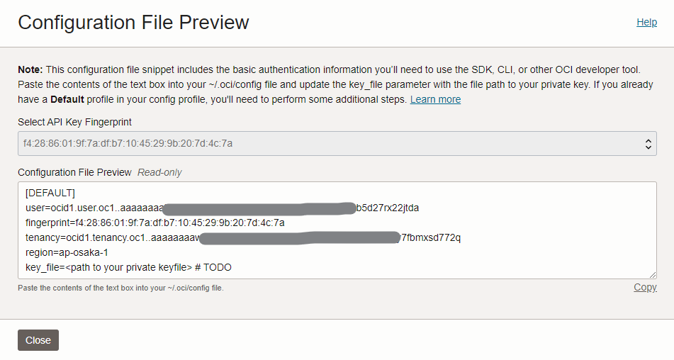

# Terraform Cloud とそれに持たせる認証情報の用意

## Terraform Cloud の初期設定

次の手順を実行してください。

- [Terraform Cloud](https://app.terraform.io/) にてアカウントを作成し、 `kory33` という名前で organization を作成してください
- **`kory33/kory33-net-meta-infra` ワークスペースを作成**します。
  <details>
    <summary>次の手順を実行してください。</summary>

  - **Create a new Workspace** を選択
  - **Version control workflow** を選択
  - **Connect to GitHub** を選択
  - **`kory33/kory33.net-meta-infra`** を追加し、選択
  - Workspace 設定の画面で
    - **Workspace Name** に `kory33-net-meta-infra` を入力
    - **Terraform Working Directory** に `terraform` を入力
    - **Apply Method** に **Manual apply** を指定
  - **Create workspace** を選択
  </details>

## Cloudflare の認証情報を Terraform Cloud に渡す

Terraform Cloud 上で実行される Terraform が Cloudflare へのリクエストを発行できるよう、Cloudflare 上で [API Token](https://developers.cloudflare.com/fundamentals/api/get-started/create-token/) を作成し、 Terraform Cloud の variable に入れる必要があります。

次の手順を実行してください。

- **必要な権限を持つ API Token を発行**します。
  <details>
    <summary>次の手順を実行してください。</summary>

  - [**Cloudflare** > **My Profile** > **API Token**](https://dash.cloudflare.com/profile/api-tokens) へ移動してください
  - **Create Token** を選択してください
  - **Create Custom Token > Get started** を選択してください。トークン設定画面が出るため、次の手順を実行してください。
    - **Token name** に `Automation Token for Terraform to manage kory33.net resources` と入力してください
    - (TODO)
  - トークンの生成を通知する画面が表示されます。この画面を閉じずに、次の手順に進んでください。
  </details>

- **発行したトークンを Terraform Cloud へ共有**します。
  <details>
    <summary>次の手順を実行してください。</summary>

  - [**Terraform Cloud** > `kory33/kory33-net-meta-infra` workspace > **Variables**](https://app.terraform.io/app/kory33/workspaces/kory33-net-meta-infra/variables) > **Workspace variables** > **Add variable** へ移動してください
  - **Terraform variable** を選択してください
  - **Key** に `cloudflare_api_token` という文字列を、 **Value** に先ほど作成した Cloudflare の API トークンを入力してください。
  - **Sensitive** にチェックを入れ、 **Add variable** してください
  </details>

## Oracle Cloud Infrastructure の認証情報を Terraform Cloud に渡す

Terraform Cloud 上で実行される Terraform が OCI (Oracle Cloud Infrastructure) へのリクエストを発行できるよう、[API Signing Key](https://docs.oracle.com/en-us/iaas/Content/API/SDKDocs/terraformproviderconfiguration.htm#APIKeyAuth) を OCI 上に登録し、秘密鍵と公開鍵の fingerprint 等の情報を Terraform Cloud の variable に入れる必要があります。

以下の手順を実行してください。この手順は 2023/02/23 時点で有効なものでしたが、OCI の認証に関する仕様が変更されている可能性があるため、必要に応じて [OCI のドキュメント](https://docs.oracle.com/en-us/iaas/Content/API/SDKDocs/terraformproviderconfiguration.htm#APIKeyAuth) を参照してください。

- **自動化に必要なユーザーとアクセスポリシーを定義**します。**[OCI Console](https://cloud.oracle.com/) 上で**次の手順を実行してください。
  <details>
    <summary>手順</summary>

  - **[Compartment](https://docs.oracle.com/en-us/iaas/Content/GSG/Concepts/settinguptenancy.htm) を作成**します。
      <details>
        <summary>次の手順を実行してください。</summary>

    - [Console 上の Compartment 管理画面](https://cloud.oracle.com/identity/compartments) に移動してください
    - **Create Component** を選択してください
    - **Name** に `kory33-net-infra` を、 **Description** に `Infrastructure required to run kory33.net services` を入力してください
    - 必要に応じて **Parent Compartment** を選択してください。デフォルト (root compartment) でも構いません。
    - **Create Compartment** してください
    </details>

  - **IAM ユーザーを作成**します。
      <details>
        <summary>次の手順を実行してください。</summary>

    - [Console 上の User 管理画面](https://cloud.oracle.com/identity/users) に移動してください
    - **Create User** を選択してください
    - **IAM User** を選択してください
    - **Name** に `kory33-net-infra-automation` を、**Description** に `The automation account responsible for kory33.net infrastructure at OCI` を入力してください
    - **Create** してください
    </details>

  - **User Group を作成**します。
      <details>
        <summary>次の手順を実行してください。</summary>

    - [Console 上の Group 管理画面](https://cloud.oracle.com/identity/groups) に移動してください
    - **Create Group** を選択してください
    - **Name** に `kory33-net-infra-automations` を、Description に `Machine accounts managing kory33.net inrastructures` を入力してください
    - **Create** してください
    </details>

  - **Policy を作成**します。
      <details>
        <summary>次の手順を実行してください。</summary>

    - [Console 上の Policy 管理画面](https://cloud.oracle.com/identity/policies) に移動してください
    - **Create Policy** を選択してください
    - **Name** に `kory33-net-automation` を、**Description** に `Allow automations to manage certain resources in the designated compartment` を入力してください
    - **Compartment** は (root) コンパートメントを選択してください
    - **Policy Builder** の **Show manual editor を有効化**し、以下のポリシー定義を貼り付けてください。

      ```
      ALLOW GROUP kory33-net-automations TO MANAGE instances IN COMPARTMENT kory33-net-infra
      ALLOW GROUP kory33-net-automations TO MANAGE virtual-network-family IN COMPARTMENT kory33-net-infra
      ALLOW GROUP kory33-net-automations TO MANAGE volume-family IN COMPARTMENT kory33-net-infra
      ALLOW GROUP kory33-net-automations TO MANAGE vaults IN COMPARTMENT kory33-net-infra
      ```

    - **Create** してください
    </details>

- **OCI API にアクセスするための鍵ペアを作成**します。**ローカルマシンで**次の手順を実行してください。
  <details>
    <summary>手順</summary>

  - Linux ターミナルを開いてください。Windows であれば、WSL 内で作業してください。
  - `/root/tmp/oci_api_key` + `/root/tmp/oci_api_key.pub` に鍵ペアを生成します。`root` で、次のコマンドをターミナルから実行してください。

    ```
    workdir="/root/tmp"
    tmpfs_name="oci_key_generation_tmpfs"

    # 1. make a work directory, or check if it already exists
    # 2. mount a tmpfs at the work directory
    # 3. generate 4096-bit RSA key in the work directory

    (mkdir "${workdir}" || [ -z "$(ls -A "${workdir}")" ]) && \
    mount -t tmpfs -o mode=1700 "${tmpfs_name}" "${workdir}" && \
    openssl genrsa -out "${workdir}/oci_api_key.pem" 4096 && \
    openssl rsa -pubout -in "${workdir}/oci_api_key.pem" -out "${workdir}/oci_api_key_public.pem"
    ```

    `workdir` はファイルが無いディレクトリを指し、`tmpfs_name` は存在しないデバイス名を指している必要があります。必要に応じて任意のパス/デバイス名に差し替えてください。

  - **ターミナルを閉じずに**次の手順に進んでください。
  </details>

- **生成した鍵のうち、公開鍵を OCI に API Signing Key として追加**し、**必要な情報を Terraform Cloud に共有します**。**[OCI Console](https://cloud.oracle.com/) 上で**次の手順を実行してください。
  <details>
    <summary>手順</summary>

  - [User 管理画面](https://cloud.oracle.com/identity/users) に移動してください
  - **Resources** > **API Keys** に移動してください
  - **Add API Key** を選択し、**Paste Public Key** を選択してください
  - **ローカルマシン上のターミナルで** `cat "${workdir}/oci_api_key_public.pem"` を実行し、出力結果を Add API Key の画面に貼り付けてください。
  - **Add** してください。次の画像のような Config File Preview が開きます (開かなかった場合、関連する情報を手動で探索してください)。

    

  - [**Terraform Cloud** > `kory33/kory33-net-meta-infra` workspace > **Variables**](https://app.terraform.io/app/kory33/workspaces/kory33-net-meta-infra/variables) > **Workspace variables** へ移動してください。
  - 次の Key / Value の組を、**Add variable** から **Sensitive な Terraform Variable** として追加してください。

    | **Key**                           | **Value**                                                                                      |
    | --------------------------------- | ---------------------------------------------------------------------------------------------- |
    | `oci_user_ocid`                   | Config File Preview の `user=` 以降                                                            |
    | `oci_user_public_key_fingerprint` | Config File Preview の `fingerprint=` 以降                                                     |
    | `oci_tenancy_ocid`                | Config File Preview の `tenancy=` 以降                                                         |
    | `oci_region`                      | Config File Preview の `region=` 以降                                                          |
    | `oci_user_private_key`            | ローカルマシン上のターミナルで<br> `cat "${workdir}/oci_api_key.pem"` <br>して得られる出力結果 |

    </details>

- **先ほど生成した秘密鍵をローカルマシンから削除**します。次のコマンドを実行してください。

  ```
  cd / && rm "${workdir}"/* && umount "${tmpfs_name}"
  ```
